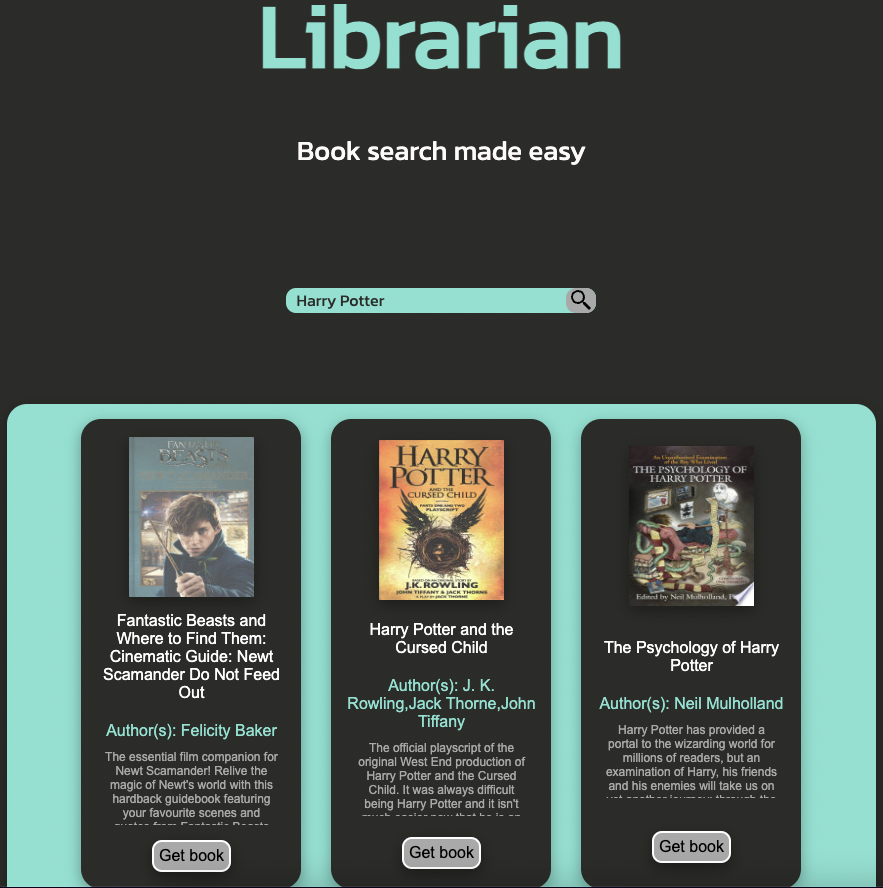

# Google Books API Project

## Description

The requirements/deliverables of this Google API project are as follows:

-   Create a page that allows users to search for books Page should include the following:
    -   Header section introducing the page
    -   Form containing a text input and a submit / search button
    -   When the submit button is clicked you need the request books from the Google books API using the input value as your query string
    -   The books that you receive should be rendered in the books grid.
    -   Each book in the grid should have an image, author, title and description
    -   The grid should be responsive on different screen sizes
    -   You should use async / await for your request code, NOT .then

## Screenshots

<figure>
<figcaption><i>Home Page</i></figcaption>

</figure>

<figure>
<figcaption><i>Book Grid</i></figcaption>

</figure>

## Stack

-   HTML
-   SCSS/SASS
-   Javascript

## Setup

Click here to access live demo of application:

🔗 [Live Demo](https://darcyjhenschke.github.io/Google-Books_UI/)

## Approach

The follwoing explains the way I approached this project:

1. Firstly, using only HTML and SCSS, build a webpage with a title, search-bar and search button
2. Write the Javascript function which takes in a query string parameter and returns the API data
    - This is the starting point for the rest of the javascript required for the application as it provides us with the necessary data that can be appended to various DOM elements.
    - This function filterd through the API promise and ultimately returns an array of which each array item is the data for one book.
3. Write the Javascript Function which takes the array of data and returns a block of HTML containing elements which encompass desired data objects (title, author, image, etc)
    - This function basically maps through the array and creates a HTML div for each array item.
    - This to me seemed like the most efficient way to create the HTML e.lements necessary without repeatedly using createElement() or a for loop
    - This function then query selects an empty div already established in the HTML an appends the blocks inside of it.
4. Write the neccessary DOM Javascript that allows users to interact with the page
    - This refers to the event listener function on the searchBar DOM element.
    - basically just takes the input value of the searchbar and parses it through the step 3 function when the form is submitted.
    - This also changes some styling by toggling classlist on the form submit.

## Challenges

The thing I struggled with the most was identifying a good way to convert the data obtained from the API and appending it to the HTML. At first I was thinking of creating an empty HTML element for everything and using query selectors to set the inner HTML value to that of the desired data. I thought this was very inefficient and repitive. As a result i spent some time researching best ways to implement API data into HTML and discovered you can return blocks of HTML as a string and then setting this string as equal to the innerHTML of an already established element.

## Additions

-   Add a modal when the book card is clicked so more information can be seen.
-   Add a drop down list which changes the number of books returned for the query.
-   Give feedback when a invalid query is parsed.
-   Add more animations/features to reduce the staticity of the page.
-   Clean up SCSS
